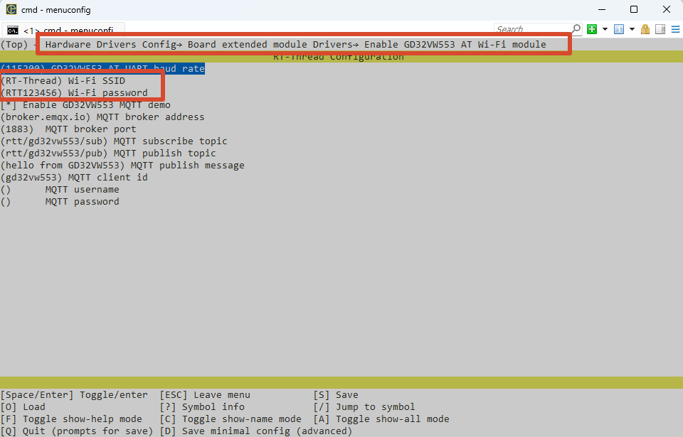

# Gino_component_mqtt

## 1. 简介

本工程是 GD32H77D Gino 开发板的 GD32VW553、SAL 与 kawaii-mqtt 发布订阅参考工程，用于单独学习、配置和验证 MQTT 发布订阅协议。独立工程只启用该功能需要的驱动和组件，可作为应用开发和功能集成的参考。

主参考设备：`wifi0`。

所有示例均保留 `uart1` 作为 FinSH/MSH 控制台，串口参数为 115200-8-N-1；PC4 LED 用于运行指示。

运行示例的时候需要修改成自己的wifi

env中的修改方式



studio中的修改方式


当前工程包含以下 MSH 命令：

| 命令                                     | 作用                                                                   | 示例/备注                               |
| ---------------------------------------- | ---------------------------------------------------------------------- | --------------------------------------- |
| `gd32vw553_mqtt_start`                 | 启动 GD32VW553 MQTT 示例，等待`wifi0` 联网后连接 Broker 并订阅主题。 | `gd32vw553_mqtt_start`                |
| `gd32vw553_mqtt_pub <topic> <message>` | 通过当前 MQTT 连接发布一条消息。                                       | `gd32vw553_mqtt_pub rtt/gino hello`   |
| `gd32vw553_mqtt_stop`                  | 停止 MQTT 示例，断开 MQTT/TCP 连接并释放客户端资源。                   | `gd32vw553_mqtt_stop`                 |
| `ifconfig`                             | 查看`wifi0` 的联网状态和 IP 地址。                                   | 确认网络已 ready。                      |
| `list_device`                          | 查看系统已注册设备。                                                   | 确认 UART、PIN、netdev 等依赖设备存在。 |
| `gino_device_probe`                    | 检查当前示例使用的主要设备是否已注册。                                 | 默认检查`wifi0`。                     |

注意使用示例的时候可以使用自己所定义的主题。

## 2. MQTT 发布订阅协议详解

示例先等待 `wifi0` ready，并临时将其设为 SAL 默认网卡。kawaii-mqtt 负责 MQTT 编解码和会话，底层 socket 经 SAL、AT socket 和 UART4 到 GD32VW553。发布命令直接调用当前 MQTT client，并把真实发送结果返回给 MSH。

一次完整的数据路径如下：

```text
MSH publish -> kawaii-mqtt -> socket/SAL -> AT socket -> UART4 -> GD32VW553 -> Broker
```

协议层只定义通信或数据处理规则，最终仍需要控制器时钟、引脚复用、中断/DMA 和上层状态机共同工作。扫描到设备、注册了总线或编译通过，都不能替代完整的数据收发验证。

## 3. GD32H77D 的 UART4 与 Cortex-M7 特性

GD32H77D 侧主要使用 Cortex-M7、UART4、RT-Thread IPC 和内存资源；实际 Wi-Fi/TCP/IP 由 GD32VW553 卸载。MQTT 报文仍在 H7 上由 kawaii-mqtt 编解码，并经 SAL/AT socket 发送。

## 4. RT-Thread AT Device、SAL 与 MQTT 设备接口

网络基础是 `wifi0` at_device/netdev 与 SAL socket。示例用 RT-Thread mutex 保护客户端状态，并调用 `mqtt_connect`、`mqtt_subscribe` 和 `mqtt_publish`。

主参考设备：`wifi0`。 设备是否已注册可先通过 `list_device` 和 `gino_device_probe` 判断；更上层的文件系统、网络或 GUI 组件还需继续验证其挂载、链路或刷新状态。

## 5. 硬件说明

GD32VW553 使用 UART4（PB12/PB13）通信，PC5 控制复位。需在本地配置 Wi-Fi、Broker、主题和认证信息。

默认控制台：UART1，PA2/PA3，AF7，115200-8-N-1。

## 6. 工程示例说明

以下源码路径以 SDK 仓库中的工程目录为基准：

- `applications/gd32vw553_mqtt_demo.c`
- `applications/gd32vw553_at_port.c`
- `../../packages/kawaii-mqtt-latest/`
- `../../packages/at_device-latest/class/gd32vw553/`

建议先阅读 `applications/main.c` 和 `applications/device_probe.c`，再沿数据路径进入对应驱动、组件或软件包。示例保留 MSH 命令，便于在不改动应用代码的情况下观察设备注册和运行状态。

### 6.1 运行命令

- `ifconfig`
- `gd32vw553_mqtt_start`
- `gd32vw553_mqtt_pub rtt/gino hello`
- `gd32vw553_mqtt_stop`

### 6.2 运行步骤

1. 检查供电、接线、外部模块和接口电平。
2. 复位开发板，确认 UART1 控制台可用且 PC4 LED 正常闪烁。
3. 执行 `list_device`，确认依赖总线和目标设备均已注册。
4. 按顺序执行上述命令，并同时观察返回值、外部波形、网络状态或显示结果。

## 7. 运行效果

### 7.1 预期现象

- `ifconfig` 显示 `wifi0` 已联网。
- 启动命令完成 TCP/MQTT 连接并订阅目标主题。
- 发布后 Broker/订阅端收到 payload，接收回调能打印订阅消息；停止命令释放客户端并恢复默认 netdev。
