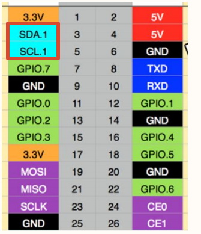

# Gino_driver_i2c

## 1. Introduction

This project is the GD32H77D Gino development board reference project for the I2C1 hardware bus. It is used to learn, configure, and validate the I2C multi-master/slave bus protocol separately. The standalone project enables only the drivers and components required by this feature, and can be used as a reference for application development and integration.

Primary device: `hwi2c1`.

All examples keep `uart1` as the FinSH/MSH console at 115200-8-N-1, and PC4 LED is used as the run indicator.

Current project provides the following MSH commands:

| Command | Function | Example/Note |
| --- | --- | --- |
| `gino_device_probe` | Check whether the primary device used by this example is registered. | Checks `hwi2c1` by default. |
| `i2c scan hwi2c1` | Scan the I2C1 bus and print responding slave addresses. | Provided by `i2c-tools`; connect a powered I2C target first. |

The project enables `i2c-tools v1.0.0` (`PKG_USING_I2C_TOOLS`) in hardware bus mode. Run `mklinks.bat` on Windows or `sh mklinks.sh` on Linux to link the bundled package before opening the project. Run `i2c` for scan/read/write usage.

## 2. I2C Multi-Master/Slave Bus Protocol Details

I2C uses open-drain SDA/SCL lines with pull-ups. The controller generates START, address, ACK, data, and STOP. `i2c scan` uses address-only write transfers to check for ACK; it does not validate device registers.

The complete data path is:

```text
MSH i2c scan -> i2c-tools -> hwi2c1 -> I2C1 controller -> PH4/PB11 -> target ACK
```

The protocol layer only defines communication and data processing rules. Final validation still depends on controller clocks, pin multiplexing, interrupt/DMA handling, and upper-layer state machines. Device discovery, bus registration, or a successful build cannot replace a complete data transfer test.

## 3. GD32H77D I2C1 Features

The project uses GD32H77D hardware I2C1 on PH4/PB11 AF4. The controller generates START/STOP, addressing, ACK/NACK, and byte timing; SDA/SCL still require pull-ups.

## 4. RT-Thread I2C Bus Device Interface

RT-Thread registers the controller as the `hwi2c1` bus. Device drivers use `rt_i2c_transfer` or `rt_i2c_master_send`/`rt_i2c_master_recv`; `i2c scan hwi2c1` scans address ACKs.

Primary device: `hwi2c1`. Use `list_device` and `gino_device_probe` first to check whether the device has been registered. Upper-layer file system, network, or GUI components still need separate validation for mount, link, or refresh state.

## 5. Hardware

I2C1 uses PH4/PB11 (AF4). The external bus requires suitable pull-up resistors.

Default console: UART1, PA2/PA3, AF7, 115200-8-N-1.

Use suitable pull-up resistors and keep a common reference with the external device.



## 6. Example

Source paths below are relative to the project directory in the SDK repository:

- `applications/main.c`
- `applications/device_probe.c`
- `../../libraries/gd32_drivers/drv_hard_i2c.c`
- `../../libraries/gd32_drivers/config/i2c_config.h`
- `../../packages/i2c-tools-v1.0.0/src/i2c_tools.c`
- `../../packages/i2c-tools-v1.0.0/src/i2c_utils.c`

Read `applications/main.c` and `applications/device_probe.c` first, then follow the data path into the corresponding driver, component, or package. The example keeps MSH commands so device registration and runtime state can be observed without changing application code.

### 6.1 Runtime Commands

- `gino_device_probe`
- `i2c scan hwi2c1 08 78`

The scan range is hexadecimal and excludes the stop address: `08 78` probes `0x08-0x77`, skipping reserved addresses. Without a range, the package scans `0x00-0x7F`. `gino_device_probe` only checks bus registration; it does not probe slave devices.

### 6.2 Operation Steps

1. Check power, wiring, external modules, and interface logic levels.
2. Reset the development board and confirm that the UART1 console is available and PC4 LED blinks normally.
3. Run `list_device` and confirm that dependency buses and target devices are registered.
4. Run the commands above in order while observing return values, external waveforms, network state, or display results.

## 7. Runtime Results

### 7.1 Expected Behavior

- `list_device` shows `hwi2c1`.
- A connected target appears in `i2c scan hwi2c1 08 78`.
- A logic analyzer shows START, a 7-bit address, ACK, and STOP.
