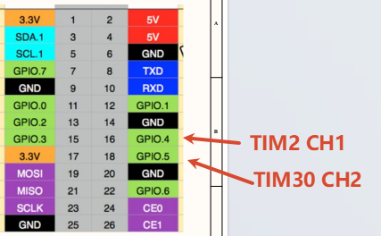

# Gino_driver_pwm

## 1. 简介

本工程是 GD32H77D Gino 开发板的 PWM2 与 PWM30 双通道输出参考工程，用于单独学习、配置和验证 PWM 定时器输出原理。独立工程只启用该功能需要的驱动和组件，可作为应用开发和功能集成的参考。

主参考设备：`pwm2`。

所有示例均保留 `uart1` 作为 FinSH/MSH 控制台，串口参数为 115200-8-N-1；PC4 LED 用于运行指示。

当前工程包含以下 MSH 命令：

| 命令                    | 作用                                   | 示例/备注                |
| ----------------------- | -------------------------------------- | ------------------------ |
| `gino_device_probe`   | 检查当前示例使用的主要设备是否已注册。 | 默认检查`pwm2`。       |
| `pwm_dual_test start` | 启动双路 PWM 输出测试。                | 在 PA7 和 PG7 输出 PWM。 |
| `pwm_dual_test stop`  | 停止双路 PWM 输出测试。                | 关闭测试输出。           |

## 2. PWM 定时器输出原理详解

PWM 由定时器周期寄存器决定频率，由比较寄存器决定高电平持续时间。示例同时驱动 `pwm2` 通道 2 和 `pwm30` 通道 3，并周期调整 pulse，用于验证两个定时器通道和引脚复用。

一次完整的数据路径如下：

```text
pwm_dual_test -> RT-Thread PWM -> TIMER/PWM 比较输出 -> PA7 与 PG7
```

协议层只定义通信或数据处理规则，最终仍需要控制器时钟、引脚复用、中断/DMA 和上层状态机共同工作。扫描到设备、注册了总线或编译通过，都不能替代完整的数据传输验证。

## 3. GD32H77D 的定时器 PWM 特性

GD32H77D 定时器使用计数周期决定 PWM 频率，比较值决定有效电平时间。工程提供 `pwm2` 通道 2（PA7）和 `pwm30` 通道 3（PG7），用于同时验证两路定时器输出。

## 4. RT-Thread PWM 设备接口

RT-Thread PWM 接口使用 `rt_device_pwm_set`/`rt_pwm_set` 设置 period 和 pulse，使用 `rt_device_pwm_enable`/`rt_pwm_enable` 启动通道，停止时调用对应 disable 接口。参数时间单位以当前 RT-Thread PWM API 定义为准。

主参考设备：`pwm2`。设备是否已注册可先通过 `list_device` 和 `gino_device_probe` 判断；更上层的文件系统、网络或 GUI 组件还需继续验证其挂载、链路或刷新状态。

## 5. 硬件说明

pwm2 通道 2 输出到 PA7，pwm30 通道 3 输出到 PG7，可使用示波器或逻辑分析仪观察。

默认控制台：UART1，PA2/PA3，AF7，115200-8-N-1。

使用示波器或逻辑分析仪确认 PA7 和 PG7 上的频率与占空比。


## 6. 工程示例说明

以下源码路径以 SDK 仓库中的工程目录为基准：

- `applications/pwm_dual_test.c`
- `../../libraries/gd32_drivers/drv_pwm.c`
- `board/Kconfig`

建议先阅读 `applications/main.c` 和 `applications/device_probe.c`，再沿数据路径进入对应驱动、组件或软件包。示例保留 MSH 命令，便于在不改动应用代码的情况下观察设备注册和运行状态。

### 6.1 运行命令

- `gino_device_probe`
- `pwm_dual_test start`
- `pwm_dual_test stop`

### 6.2 运行步骤

1. 检查供电、接线、外部模块和接口电平。
2. 复位开发板，确认 UART1 控制台可用且 PC4 LED 正常闪烁。
3. 执行 `list_device`，确认依赖总线和目标设备均已注册。
4. 按顺序执行上述命令，并同时观察返回值、外部波形、网络状态或显示结果。

## 7. 运行效果

### 7.1 预期现象

- `list_device` 中出现 `pwm2` 和 `pwm30`。
- 启动测试后 PA7、PG7 输出约 2 kHz PWM。
- 示波器可观察到占空比按示例规律变化，停止后输出关闭。
