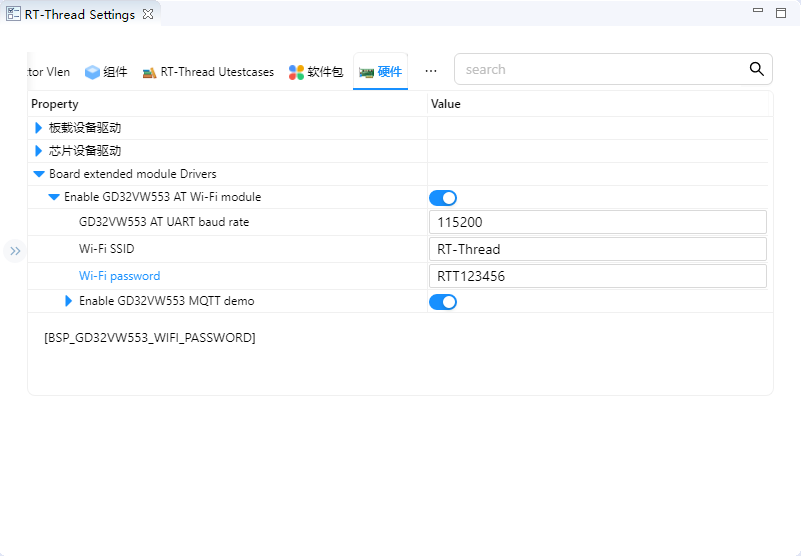

# Gino_factory

## 1. Introduction

This project combines LVGL, camera, MQTT, Ethernet, storage, and common peripherals on the GD32H77D Gino board. Use the touch interface and console to operate the enabled features.

Primary device: `lcd`.

All examples keep `uart1` as the FinSH/MSH console at 115200-8-N-1, and PC4 LED is used as the run indicator.

Current project provides the following MSH commands:

| Command | Function | Example/Note |
| --- | --- | --- |
| `ov7670_preview start` | Request live camera preview on the LCD. | Use after the display and camera are ready. |
| `gd32vw553_mqtt_start` | Start the GD32VW553 MQTT demo. | Connects Wi-Fi, Broker, and subscription path. |
| `ifconfig` | Check the connection state and IP address of the netdev. | Confirm that the network is ready. |
| `list_device` | List registered system devices. | Confirm that UART, PIN, buses, and target devices exist. |
| `i2c scan hwi2c1 08 78` | Scan external I2C addresses `0x08-0x77`. | Provided by `i2c-tools`; the external bus is `hwi2c1`. |

The I2C touch page scans only the external `hwi2c1` bus (SCL PH4, SDA PB11). Its Scan button uses address-only transfers in `board_demo_backend.c`. The camera and GT911 touch controller use `hwi2c2` and `hwi2c3` respectively; these buses have no scan entry in the UI. The console uses the bundled `i2c-tools v1.0.0` package in hardware bus mode. Run `mklinks.bat` on Windows or `sh mklinks.sh` on Linux before opening the project. Run `i2c` for scan/read/write usage; scan ranges are hexadecimal with an exclusive stop address.

The SPI page performs a full-duplex SPI3 loopback test: connect PF1 (MOSI) to PF0 (MISO); SCK is PE12. The test uses mode 0, 8-bit data and no chip select. Select the maximum clock frequency and transfer length, then press Run loopback. The screen log shows queuing, configuration, the complete TX/RX hex data and PASS/FAIL, including the first mismatching byte offset and values.

The I2C page uses a 16-column address matrix like `i2c-tools`: responding devices show their address, `--` means no response, `..` means unscanned, and `!!` marks a probe error. Reserved addresses remain blank. The scan covers `0x08-0x77`, updates each address result, and reports the device count and elapsed time. There is no per-address sleep. Bus locking waits at most 100 ms; while holding the lock, each probe temporarily caps the driver's wait-stage timeout at 20 ms and then restores it. Timeouts or other bus errors stop the scan and preserve partial results instead of reporting an incomplete scan as an empty bus.

The Scan log retains responding addresses, errors and the final result. SPI and I2C tests disable their buttons and parameter selectors while pending or running, and report submission errors. Logs also go to the console; each test retains the latest 3 KB for the current request in a scrollable screen panel. These screen logs cover requests made from the touch UI. The I2C page scans addresses only; it does not program chip data or firmware.

### 1.1 Wi-Fi Configuration

Before running the factory demo, configure the Wi-Fi SSID and password for your own network. The procedure and screenshots follow `Gino_component_mqtt`, but each project has its own configuration: make these changes in `Gino_factory`.

The onboard GD32VW553 AT module uses UART4 (TX PB12, RX PB13, AF14), with PC5 controlling reset. Its network device is `wifi0`; UART1 remains the console.

**Env**

1. In Env, enter `projects\Gino_factory` from the SDK root and run `mklinks.bat` if the shared directory links have not been created.
2. Run `menuconfig` and open the following menu:

   ```text
   Hardware Drivers Config
       -> Board extended module Drivers
           -> Enable GD32VW553 AT Wi-Fi module
   ```

3. Keep the module enabled and set `Wi-Fi SSID` and `Wi-Fi password` to your network's values. Keep `GD32VW553 AT UART baud rate` at `115200` unless the module firmware uses a different rate.
4. Save and exit, then run `scons --pyconfig-silent` to update `rtconfig.h`. For MDK5, also run `scons --target=mdk5` to update the project files.


**RT-Thread Studio**

1. Open the factory project's `RT-Thread Settings` and select the hardware tab.
2. Expand `Board extended module Drivers -> Enable GD32VW553 AT Wi-Fi module` and keep the module enabled.
3. Set `Wi-Fi SSID` and `Wi-Fi password`, confirm the AT UART baud rate, and save the settings to update the project configuration.



The two fields correspond to `BSP_GD32VW553_WIFI_SSID` and `BSP_GD32VW553_WIFI_PASSWORD`. Use your own network values instead of the values shown in the screenshots. After saving, rebuild and download the factory firmware, then reset the board to apply the configuration.

### 1.2 Wi-Fi and MQTT Verification

Run `ifconfig` on UART1 and confirm that `wifi0` is up, its link is up, and its IP address is not `0.0.0.0`. The factory project also enables Ethernet `e0`; an Ethernet connection alone does not confirm that Wi-Fi is ready. If `wifi0` does not connect, check the SSID, password, access point availability, module power/reset, and AT UART baud rate.

To use MQTT, keep `Enable GD32VW553 MQTT demo` enabled in the same configuration menu and set the broker address/port, subscribe/publish topics, client ID, and optional username/password for your service. You can use your own topics. Use a numeric IPv4 broker address when the module firmware does not support DNS through `AT+CIPDOMAIN`.

After applying the configuration and confirming that `wifi0` is ready, run:

```text
gd32vw553_mqtt_start
gd32vw553_mqtt_pub rtt/gino hello
gd32vw553_mqtt_stop
```

Wait for the MQTT connection and subscription to succeed before publishing. Replace `rtt/gino` with your own topic and confirm that the broker/subscriber receives the message. The MQTT demo temporarily selects `wifi0` as the default network device and restores the previous default when it stops.

## 2. Concurrent Peripheral System Integration Details

The factory project verifies that independently working features can share pins, initialization levels, DMA, cache, SDRAM, default routes, and heap. Display continuously scans SDRAM, camera and ENET use DMA, Wi-Fi/MQTT selects `wifi0` through SAL, and filesystems mount after devices register. This more closely represents a real product workload.

The complete data path is:

```text
driver registration -> DFS/lwIP/LVGL/SAL -> concurrent display + camera + storage + e0/wifi0 + MQTT
```

The protocol layer only defines communication and data processing rules. Final validation still depends on controller clocks, pin multiplexing, interrupt/DMA handling, and upper-layer state machines. Device discovery, bus registration, or a successful build cannot replace a complete data transfer test.

## 3. GD32H77D Multiple Buses, DMA Engines, and Memories Features

The integrated project uses SDRAM/TLI/DSI, DCI/DMA, ENET1, OSPI0, SDIO1, USBHS, CAN, SPI, I2C, UART, and timers together. It validates shared pins, DMA, cache, bandwidth, memory regions, and interrupt priorities.

## 4. RT-Thread Integrated Devices and Components Device Interface

RT-Thread runs the device framework, DFS/FAL/FatFs, lwIP/netdev/SAL, at_device, LVGL, touch, camera, and MQTT threads together. Stable names, init levels, and IPC coordinate modules.

Primary device: `lcd`. Use `list_device` and `gino_device_probe` first to check whether the device has been registered. Upper-layer file system, network, or GUI components still need separate validation for mount, link, or refresh state.

## 5. Hardware

Enables the 720 x 720 LCD, GT911, OV7670, GD32VW553, ENET1, OSPI flash, SDIO, USB, CAN, SPI, I2C, and PWM. Follow each standalone project's wiring and electrical requirements.

Default console: UART1, PA2/PA3, AF7, 115200-8-N-1.


## 6. Example

Source paths below are relative to the project directory in the SDK repository:

- `applications/board_demo.c`
- `applications/board_demo_backend.c`
- `applications/lv_port.c`
- `applications/ov7670_preview.c`
- `applications/gd32vw553_mqtt_demo.c`
- `board/SConscript`

`tests/run_host_tests.ps1` uses host GCC and a simulated bus to check command dispatch, scan results, timeout aborts and timeout restoration without building firmware. It defaults to MSYS2 UCRT64 GCC; use `-Compiler` to select another path. Tests extract the current backend functions directly and do not replace board checks of wiring, ACK signals or actual scan timing.

Read `applications/main.c` and `applications/device_probe.c` first, then follow the data path into the corresponding driver, component, or package. The example keeps MSH commands so device registration and runtime state can be observed without changing application code.

### 6.1 Runtime Commands

- `ov7670_preview start`
- `gd32vw553_mqtt_start`
- `ifconfig`
- `list_device`
- `i2c scan hwi2c1 08 78`

### 6.2 Operation Steps

1. Check power, wiring, external modules, and interface logic levels.
2. Reset the development board and confirm that the UART1 console is available and PC4 LED blinks normally.
3. Run `list_device` and confirm that dependency buses and target devices are registered.
4. Run the commands above in order while observing return values, external waveforms, network state, or display results.

## 7. Runtime Results

### 7.1 Expected Behavior

- `list_device` shows enabled display, touch, camera, storage, network, and bus devices.
- LVGL, preview, Ethernet/Wi-Fi, and filesystems start independently and coexist under reasonable load.
- The touch UI provides board feature controls; the console can operate camera, networking, and MQTT.
- The I2C touch page and `i2c scan` list responding slave addresses on the selected bus.
- The SPI loopback page shows TX/RX data and verification results; the I2C page shows scan progress logs and responding addresses.
